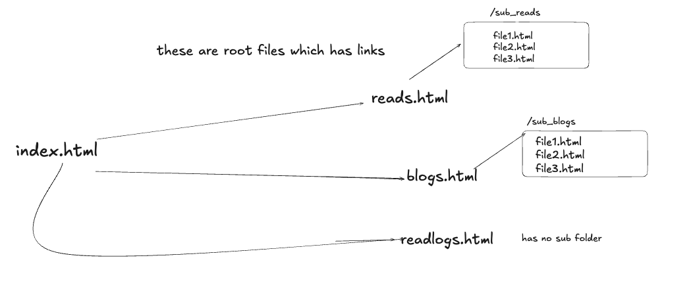

# Hanamark

**Hanamark** powers [thisisvoid.in](https://www.thisisvoid.in). A minimal and efficient static site blog generator engine.

> Write in Markdown. Style with templates. Deploy with ease.

---

## Table of Contents

- [Objective](#objective)
- [How It Works](#how-it-works)
- [Templates](#templates)
- [Parser](#parser)
- [Assets](#assets)
- [Logger](#logger)
- [Customization](#how-to-customize-hanamark)
  - [Configuring `config.json`](#configuring-configjson)
- [Running Locally](#how-to-run-locally)

---

## Objective

The core idea behind **Hanamark** is:

- Take a collection of Markdown files.
- Convert them into styled HTML files using templates.
- Automatically add headers, footers, and other layout components.
- Deploy the final output easily.

This workflow helps **you focus only on writing** your blog posts in Markdown, while Hanamark handles the heavy lifting of rendering and structuring your static site.



---

## How It Works

- Each Markdown file is parsed and matched with a predefined template.
- Templates are HTML snippets (header, footer, content layout, etc.) that can be reused and customized.
- File mappings and output destinations are defined in a single **config.json**.
- Hanamark supports logs and assets (CSS/images) out of the box.

---

## Templates

Templates form the building blocks of your blog layout.

- Common templates include **header.html**, **footer.html**, and various page-specific templates (e.g. blog post layout, project list layout).
- All templates live under the **./templates/** directory.
- You can style and structure each page type differently using custom templates.
- Easily configurable via **config.json**.

---

## Parser

The parser is responsible for:

- Reading Markdown content.
- Converting it into HTML.
- Inserting the content into the appropriate HTML templates.
- Handling all template rendering logic.

---

## Assets

- All CSS and images are stored in the **./assets/** directory.
- CSS: Located in **./assets/css/**. Customize it to match your blog's aesthetic.
- Images: Store blog-specific images under a folder named after the blog, or use a central `images/` folder.

---

## Logger

- Logging is powered by [Uber's zap](https://github.com/uber-go/zap), a high-performance logger for Go.
- Configure output log path and verbosity level in the **config.json**.
- Logs help track parsing issues and system operations.

---

## How to Customize Hanamark

Customizing Hanamark is simple and flexible:

1. **CSS Styling**  
   Add your styles to `./assets/css/`.

2. **HTML Templates**  
   Modify or create new templates in `./templates/`.

3. **Configuration File**  
   The heart of the system is `config.json`.

---

### Configuring config.json

Here's a breakdown of the config sections:


#### `filepath`

```json
"filepath": {
  "sourceMDRoot": "../markdown-blog/",
  "destMDRoot": "../personal-site/",
  "templatePath": "./templates",
  "sourceAssetsPath": "../markdown-blog/assets/",
  "destAssetsPath": "../personal-site/assets/",
  "hanamarkCssPath": "./assets/css/",
  "destCssPath": "../personal-site/assets/css/"
}
```

Defines all important source and destination paths for Markdown, templates, CSS, and assets.

---

#### `userMeta`

```json
"userMeta": {
  "by": "void",
  "email": "thisisvoiddd1@gmail.com",
  "twitter": ""
}
```

Used for injecting metadata (e.g. author name) into templates such as footers.

---

#### `fileMeta`

```json
"fileMeta": {
  "baseFilesMap": {
    "index.html": "./blogs_src/",
    "readlogs.html": "./readlogs.md",
    "projects.html": "./projects.md",
    "watchlogs.html": "./watchlogs.md",
    "reads.html": "./reads.md",
    "about.html": "./about.md"
  },
  "templateMap": {
    "./blogs_src/": "blogpost_template.html",
    "index.html": "index_template.html",
    "readlogs.html": "readlogs_template.html",
    "projects.html": "projects_template.html",
    "watchlogs.html": "watchlog_template.html",
    "reads.html": "read_template.html",
    "about.html": "about_template.html"
  }
}
```

This section is **critical** for defining how each Markdown file or directory maps to:

- Output file names
- Corresponding templates for rendering

  - baseFilesMap has all the base files mapped. notice that index.html has a folder thats been configured. this is because here index.html will have links to all the files inside ./blogs_src/
  eg: 
index.html
 - this is a link to blog1
 - this is a link to blog2
 where blog1 and blog 2 are blog files inside ./blogs_src/
 so if you want a sub directory that needs to be linked with an html file confiure the path of subdirectory
 **"readlogs.html": "./readlogs.md"**,
 this means readlogs.html is formed by directly parsing our readlogs.md in source directory
 - template map is to identify which html uses which template to be created
 - eg:  "./blogs_src/": "blogpost_template.html", files under blogs_src uses blogpost_template.html to create the output html
  "index.html": "index_template.html", index.html uses index_template.html to create the output html
  all these filemeta can be added or removed based on your blog style

> **Example:**  
> `index.html` is generated from the Markdown files in `./blogs_src/` using `index_template.html`.  
> `readlogs.html` is generated directly from `readlogs.md`.

---

#### `logger`

```json
"logger": {
  "filepath": "hanamark.logs",
  "level": "debug"
}
```

Specify where logs should be stored and what level of detail to capture (`debug`, `info`, `error`, etc.).

---

## How to Run Locally

### Prerequisites

- Go installed (`>= 1.20`)
- Make installed (optional but recommended)

### First-Time 

```bash
make init
```

Initializes the project, installs dependencies, and prepares directories and runs the project.

### To Run Consecutive times

```bash
make run
```
